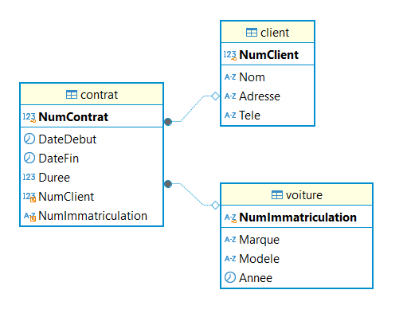

 

# Mahjoub Echcherkaoui

Welcome to the project documentation. This file contains the steps to create, manage, and query tables for clients, vehicles, and contracts in a database. Below, you will find the details, SQL scripts, and instructions for each operation.

---

## 📋 Project Overview

This project consists of a relational database with three main tables:

1. **Clients**: Stores client details.
2. **Voitures**: Stores vehicle information.
3. **Contrats**: Stores contract information linking clients and vehicles.

---

## 📁 Tables Creation

The following SQL commands create the required tables with their relationships:

```sql
CREATE TABLE clients (
    NumClient INT NOT NULL AUTO_INCREMENT PRIMARY KEY,
    Nom VARCHAR(30),
    Adresse VARCHAR(100),
    Tele VARCHAR(10)
);

CREATE TABLE Voitures (
    NumImmatriculation VARCHAR(50) PRIMARY KEY,
    Marque VARCHAR(50),
    Modele VARCHAR(50),
    Annee YEAR
);

CREATE TABLE Contrats (
    NumContrat INT PRIMARY KEY,
    DateDebut DATE,
    DateFin DATE,
    Duree INT,
    NumClient INT,
    NumImmatriculation VARCHAR(50),
    FOREIGN KEY (NumClient) REFERENCES Clients(NumClient),
    FOREIGN KEY (NumImmatriculation) REFERENCES Voitures(NumImmatriculation)
);
```

---

## 📥 Data Insertion

The following commands insert sample data into the tables:

```sql
INSERT INTO Clients (NumClient, Nom, Adresse, Tele) VALUES
(1, 'Ahmed Saidi', 'Casablanca, Maroc', '0612345678'),
(2, 'Fatima El Amri', 'Rabat, Maroc', '0678901234');

INSERT INTO Voitures (NumImmatriculation, Marque, Modele, Annee) VALUES
('1234ABC', 'Toyota', 'Corolla', 2020),
('5678XYZ', 'Renault', 'Clio', 2021);

INSERT INTO Contrats (NumContrat, DateDebut, DateFin, Duree, NumClient, NumImmatriculation) VALUES
(1, '2024-01-01', '2024-01-10', 10, 1, '1234ABC'),
(2, '2024-02-01', '2024-02-05', 5, 2, '5678XYZ');
```

---

## 🔍 Queries and Operations

### 1. Display Contracts List

```sql
SELECT
    Contrats.NumContrat,
    Clients.Nom AS NomClient,
    Clients.Adresse AS AdresseClient,
    Voitures.Marque,
    Voitures.Modele,
    Contrats.DateDebut,
    Contrats.DateFin,
    Contrats.Duree
FROM Contrats
INNER JOIN Clients ON Contrats.NumClient = Clients.NumClient
INNER JOIN Voitures ON Contrats.NumImmatriculation = Voitures.NumImmatriculation;
```

### 2. Find Contracts with Duration > 7 Days

```sql
SELECT *
FROM Contrats
WHERE Duree > 7;
```

### 3. Add New Client, Vehicle, and Contract

```sql
INSERT INTO Clients (NumClient, Nom, Adresse, Tele)
VALUES (3, 'Mohamed Youssef', 'Tanger, Maroc', '0654321098');

INSERT INTO Voitures (NumImmatriculation, Marque, Modele, Annee)
VALUES ('9876LMN', 'Peugeot', '208', 2022);

INSERT INTO Contrats (NumContrat, DateDebut, DateFin, Duree, NumClient, NumImmatriculation)
VALUES (3, '2024-03-01', '2024-03-07', 7, 3, '9876LMN');
```

### 4. Delete Contracts

```sql
DELETE FROM Contrats
WHERE DateFin < '2024-02-01';

DELETE FROM Contrats WHERE NumContrat = 2;
```

### 5. Use Aggregate Functions

#### Max Duration:

```sql
SELECT MAX(Duree) AS MaxDuree FROM Contrats;
```

#### Min Duration:

```sql
SELECT MIN(Duree) AS MinDuree FROM Contrats;
```

#### Total Contracts:

```sql
SELECT COUNT(*) AS TotalContrats FROM Contrats;
```

#### Average Duration:

```sql
SELECT AVG(Duree) AS AvgDuree FROM Contrats;
```

### 6. Update Data

#### Update Client Info:

```sql
UPDATE Clients
SET Adresse = 'Marrakech, Maroc', Tele = '0612345679'
WHERE NumClient = 1;
```

#### Update Vehicle Info:

```sql
UPDATE Voitures
SET Modele = 'Megane', Annee = 2022
WHERE NumImmatriculation = '5678XYZ';
```

#### Update Contract Info:

```sql
UPDATE Contrats
SET Duree = 15, DateFin = '2024-05-15'
WHERE NumContrat = 2;
```

### 7. Drop and Add Keys

#### Drop Primary Key:

```sql
ALTER TABLE Clients DROP PRIMARY KEY;
```

#### Handle Foreign Key:

```sql
ALTER TABLE Contrats DROP FOREIGN KEY contrat_ibfk_1;

ALTER TABLE Contrats
ADD CONSTRAINT contrat_ibfk_1 FOREIGN KEY (NumClient) REFERENCES Clients(NumClient);
```

---

## 🖼️ Visual Overview

Here’s a visual representation of the database relationships:


---

## 🛠️ Tools and Technologies

- **Database**: MySQL
- **Language**: SQL
- **Environment**: Any SQL Client (MySQL Workbench, phpMyAdmin, etc.)

---

## ✨ Author

- **Name**: Mahjoub Echcherkaoui
- **Contact**: [Your Email or Social Handle]

Feel free to contribute or suggest improvements to this project!

📋 Overview
This project is a database design for managing a car rental system. It includes three main tables:

Clients: Contains client details such as name, address, and phone number.
Voitures (Cars): Stores information about cars, including their brand, model, and year.
Contrats (Contracts): Handles rental agreements between clients and cars.
🖼️ Entity-Relationship Diagram (ERD)
Below is the ERD that demonstrates the relationships between the tables:

